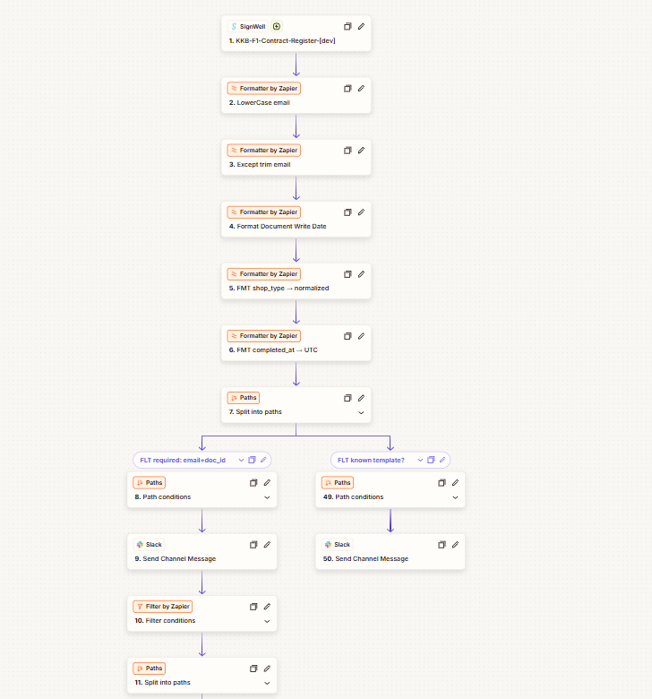

# KKB-F1-Contract-Register-[dev] Zap Path Overview

This document outlines the common utility steps and the four (4) main branches (Paths) of the Zap, following the SignWell trigger.

---

## 1. Common Utility & Validation Steps (KKB-F1-4, KKB-F1-10)

These steps run immediately after the trigger to normalize data and validate input before any branching occurs.

**Key Steps:**
1.  **FMT Email → lower+trim (KKB-F1-4):** Normalizes the `signer_email` to lowercase and removes whitespace, creating `normalized_email`.
2.  **FMT shop_type → normalized (KKB-F1-4):** Uses a Lookup Table to convert `shop_type` input (e.g., "charter") to a standard value (e.g., "Charter").
3.  **FMT completed_at → UTC (KKB-F1-4):** Converts the `completed_at` timestamp to a standard UTC format for Airtable.
4.  **FLT required: email+doc_id (KKB-F1-10):** **Stops Zap** if `normalized_email` OR `doc_id` **Does Not Exist**, preventing errors from missing data.
5.  **FLT known template? (KKB-F1-10):** **Stops Zap** if the `template_name` **Is Not One Of** the approved templates, preventing unknown contracts from processing.

---

## Path A: Shop Partner (KKB-F1-6)

This path handles the "Shop Partner Agreement" and includes logic for Charter status.

**Key Steps:**
1.  **AT Find/Create Partner (Shop):** Finds or creates the Partner record. Sets `Partner Type = Shop`.
2.  **FLT shop_type mapped?:** **Stops Zap** if the `normalized_shop_type` is `UNMAPPED` (from the KKB-F1-4 Lookup Table).
3.  **AT Update Shop Type:** Updates the Partner record from Step 1 with the `normalized_shop_type` (Charter or Non-Charter).
4.  **FMT Charter End Date +1y:** (Conditional Step) Runs **only if** `normalized_shop_type = Charter`. Calculates `signed_at_utc` + 1 Year.
5.  **AT Set Charter End Date:** (Conditional Step) Runs **only if** `normalized_shop_type = Charter`. Updates the Partner record with the new `charter_end_date_utc`.
6.  **AT Find Contract by ID (KKB-F1-9):** Checks for duplicate `doc_id`.
7.  **FLT Already have contract? (KKB-F1-9):** **Stops Zap** if duplicate.
8.  **AT Create Contract (Shop):** Creates the `Contracts` record. Sets `Contract Type = Shop Partner`.
9.  **SLK Notify (Shop):** Sends a success alert to `#automation-alerts`.

---

## Path B: Individual Partner (KKB-F1-5)

This path handles the "Individual Partner Agreement".

**Key Steps:**
1.  **AT Find/Create Partner (Individual):** Finds a Partner by `normalized_email` or creates a new one if not found. Sets `Partner Type = Individual`.
2.  **AT Find Contract by ID (KKB-F1-9):** Checks the `Contracts` table for `doc_id` to prevent duplicate contract creation.
3.  **FLT Already have contract? (KKB-F1-9):** **Stops Zap** if `ID Exists` (meaning this contract was already processed).
4.  **AT Create Contract (Individual):** Creates the new `Contracts` record, linking it to the Partner from Step 1. Sets `Contract Type = Individual Partner`.
5.  **SLK Notify (Individual):** Sends a success alert to the `#automation-alerts` channel.

---

## Path C: Ambassador (KKB-F1-7)

This path handles the "Ambassador Agreement".

**Key Steps:**
1.  **AT Find/Create Partner (Ambassador):** Finds or creates the Partner record. Sets `Partner Type = Ambassador`.
2.  **AT Find Contract by ID (KKB-F1-9):** Checks for duplicate `doc_id`.
3.  **FLT Already have contract? (KKB-F1-9):** **Stops Zap** if duplicate.
4.  **AT Create Contract (Ambassador):** Creates the `Contracts` record. Sets `Contract Type = Ambassador`.
5.  **SLK Notify (Ambassador):** Sends a success alert to `#automation-alerts`.

---

## Path D: Parts Addendum (KKB-F1-8)

This path handles the "Individual Parts Agreement (Addendum)" and only *finds* existing partners.

**Key Steps:**
1.  **AT Find Partner (Addendum):** **Finds** an existing Partner by `normalized_email`. **Create if not found: Off**.
2.  **FLT Partner exists?:** **Stops Zap** and sends an alert (KKB-F1-10 logic) if `ID Does Not Exist`. This ensures only existing partners can add parts.
3.  **AT Find Part dup (KKB-F1-9):** Checks `Parts` table using a formula (`Owner`, `Part Description`, `Source Doc ID`) to prevent duplicate part entries from the same document.
4.  **FLT Part duplicate? (KKB-F1-9):** **Stops Zap** if `length > 0` (meaning a duplicate was found).
5.  **CODE compat+condition normalize:** Runs JavaScript (KKB-F1-8) to:
    * Create the `vehicle_compat` string (e.g., "2017 BMW F30").
    * Normalize `condition_final` (e.g., forces "Unknown" to "As-Is").
6.  **AT Create Part (from Addendum):** Creates the new `Parts` record, linking the `Owner` (from Step 1) and using the normalized data (from Step 5).

7.  **SLK Notify: Part created (awaiting receipt):** Sends a success alert to `#automation-alerts`.

