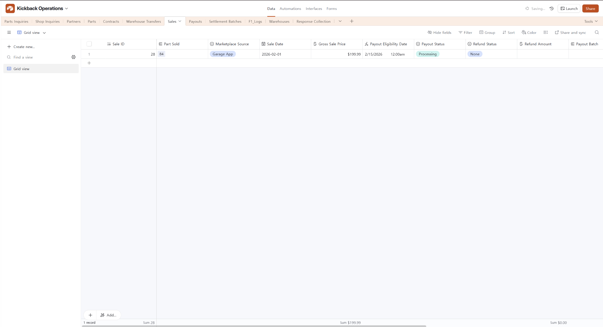
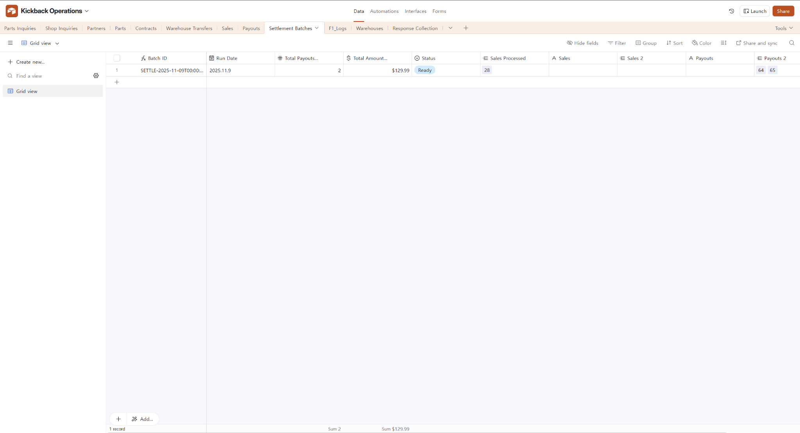
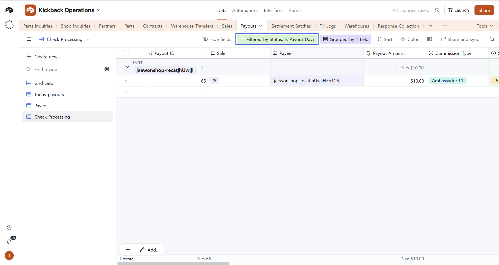
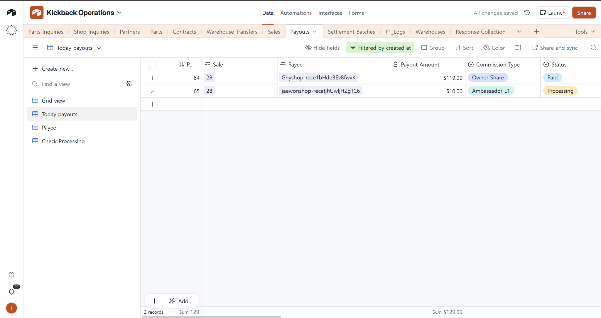
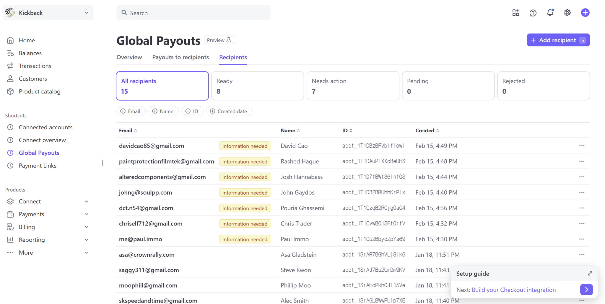
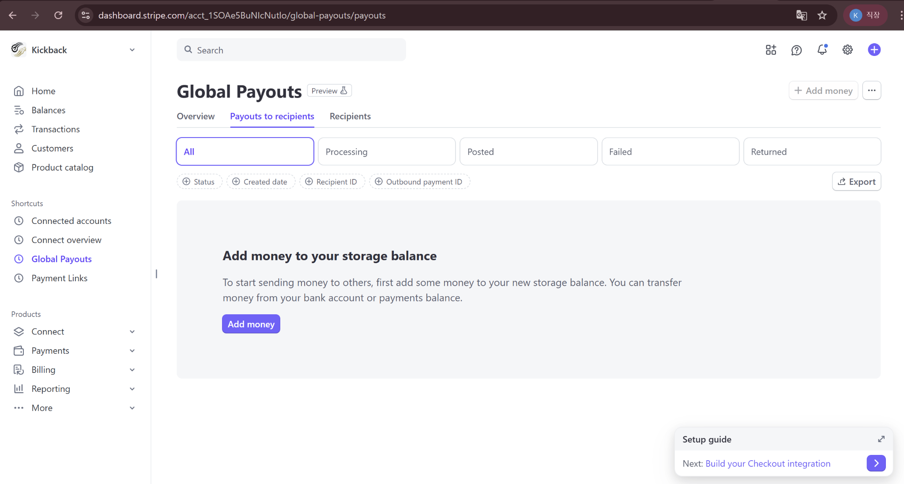

# Airtable Payout Processing – Complete Operations Manual

# Kickback Manual Settlement & Stripe Payout Operations Guide

Version: v1.2

Purpose: This guide explains how to confirm “who to pay and how much” in Airtable, execute manual payouts in the Stripe Dashboard, and accurately close out records in Airtable.

---

## 1) Settlement policy (rules) — non-negotiables

### 1-1. When an item becomes “included in settlement”

* A sale becomes eligible only after **Sales.`Payout Eligibility Date` (= Sale Date + 14 days)** has passed.
* In other words, **do not settle immediately after a sale.** (There is a 14-day waiting period for refunds/returns/disputes.)

### 1-2. Fixed “actual payout days”

* **Shop (monthly)**: send payouts on the **1st of every month**
* **Individual / Ambassador / Referral Partner (twice per month)**: pay on **bi-weekly Fridays**
  * Operating rule: **the “first Friday” of each month + the Friday 14 days after that (= the second payout day in that month)**
  * This is **not** “every Friday.” It is **two Fridays per month**.

---

## 2) Terms (as used in day-to-day ops)

* **Sale (Sales table)**: a single sales record
* **Payout (Payouts table)**: one line item that represents “who gets how much”
  * One Sale can generate multiple Payout lines (Owner, Shop, Ambassador, etc.)
* **Settlement Batch (Settlement Batches table)**: one settlement run (a bundle)
  * Used to group and manage multiple Payouts together
* **Payee**: the recipient (a record in the Partners table)

---

## 3) Status definitions — to prevent operational confusion

### 3-1. `Payouts.Status` (payout line status)

* **Payable**: payout line exists, not yet sent (waiting)
* **Processing**: selected for the current payout run (ready to send)
* **Paid**: actually sent in Stripe (change to this only after sending)
* **On Hold**: cannot be sent right now (blocked due to issues)
* **Error**: processing error (needs investigation)

### 3-2. Processing vs On Hold (the most confusing part)

* **Processing = “ready to send”**
  * You can send it in Stripe now.
* **On Hold = “cannot send”**
  * You must resolve the `Hold Reason` first.
  * Examples: Stripe account not ready, not Verified, missing Connected Account ID, etc.

> Summary: **Processing is the “send queue,” On Hold is “not payable.”**

---

## 4) Does `Next Payout Date` update automatically?

Yes. **`Next Payout Date` is calculated from TODAY to show the next scheduled payout day.**

So **after a date passes, it automatically moves to the next payout date.**

* For Shop: next **1st**
* For Bi-Weekly: **first Friday / +14 days Friday / (if both passed) next month’s first Friday**

### Then what do we update after sending?

* **Usually you do not touch `Next Payout Date`** (it auto-advances).
* As the proof that money was sent:
  * It’s recommended to update **Partners.`Last Payout Date` to the send date**.
    * Currently, when you set Payouts `Status = Paid`, **Partners.`Last Payout Date` is auto-updated**.
  * And for Payouts, closing means: **set `Paid` + record `Stripe Transfer ID`**.

---

## 5) Commission rules (`Commission Type`) — why money becomes multiple lines

When a Sale becomes eligible, Payouts may create the following lines depending on the situation.

### 5-1. Owner Share (seller / owner share)

Based on **Gross Sale Price**:

* **$250 or less**: Owner **60%**
* **$500 or less**: Owner **65%**
* **Over $500**: Owner **70%**

### 5-2. Shop Referral Fee (shop share)

* Condition: **Individual sale + attributed to a Shop**
* **5%**

### 5-3. Ambassador share

* **Ambassador L1 = 5%** (direct attribution)
* **Ambassador L2 = 5%** (attributed via Shop)

### 5-4. Referral Partner Fee (referral partner share)

* **3%**
* However, for a **specific Owner–Referrer pair, it is paid only once**
  * Prevent duplicates with `Referral One-time Key`

### 5-5. Clawback

* Used when you need a **negative settlement** due to refund/adjustment, etc.

---

## 6) End-to-end process — “when / what / where”

### A. Ongoing (daily): Sales entry & checks

1. **Enter the sale in the Sales table**
   * Required checks:
     * `Sale Date`
     * `Gross Sale Price`
     * `Part Sold`
     * `Refund Status` (usually None)
2. **Confirm `Payout Eligibility Date`**
   * Auto-calculated (Sale Date + 14 days)
   * Do not send payouts before this date.

**Example sales record (Processing)**

---

### B. Settlement prep: create “payout candidates” (Airtable)

When the settlement automation runs every morning at 9 AM:

* Eligible Sales generate Payouts, and
* They are grouped into a Settlement Batch.

**Example settlement batch (Ready)**

The operator’s key task: **select the correct set of recipients to pay today.**

---

## Explanation of the 3 views in the Payouts table

### 1) Check Processing (“source of truth” view for executing payouts)

**Purpose**

This view shows **only the payouts that should actually be sent today**.

On payout days (bi-weekly Friday / monthly 1st), operators open only this view and execute payouts.

**Filters (required)**

* `Status = Processing`
* `Is Payout Day? = 1`
  → Safety guard that keeps only partners whose payout day is today.

**Grouping (recommended)**

* Group by: `Payee`
  → Shows Payee totals immediately, enabling **one consolidated payout per Payee** in Stripe.

**Screenshot**

**Ops tips**

* Before sending: check each Payee’s total in Check Processing
* In Stripe: send **one consolidated payout per Payee**
* After sending: set those payout lines to `Paid` and enter `Stripe Transfer ID`

---

### 2) Today payouts (verification view for “records created today”)

**Purpose**

Used to confirm that today’s automation ran properly and created payout lines / linked batches.

This is **not** for sending money; it is for checking payout generation.

**Filter**

* `created at is today`
  → shows only payouts created today

**Screenshot**

**What to verify (checklist)**

* Were payouts created today?
* Are `Sale` / `Payee` links valid?
* Is `Payout Batch` populated?
* Are statuses classified as Processing / On Hold / Payable according to policy?

**Abnormality triggers (investigate immediately)**

* `Status = Error` exists (≥ 1)
* Any payout with empty `Payout Batch`
* Any payout with empty `Payee` or `Sale` link
* On Hold spikes unusually compared to normal

---

### 3) Payee (dashboard / audit view for overall payout status)

**Purpose**

A Payee-level view to see all payout status over time.

Used more for **status monitoring / partner inquiries / audit**, not for sending.

**Grouping**

* Group by: `Payee`
* Sub-group by: `Status`
  → See how much is accumulated per Payee across Payable / Processing / On Hold / Paid.

**Screenshot**

---

### Summary: “Which view to use when”

* **Today payouts**: daily check that automation created payout records correctly
* **Check Processing**: actual “send list” for payout day execution
* **Payee**: full Payee-level status overview / holds / partner support / audit

---

### [Daily Check] Today payouts verification routine (automation anomaly detection)

**Purpose**

Confirm that the morning settlement automation ran correctly and created Payouts/Batches.

**Timing**

Once per day, recommended **between 9–10 AM** (after the automation runs)

**How**

1. Airtable → Payouts → open **Today payouts**
2. Verify:
   * Are there any payouts created today?
     * If 0: either no eligible Sales today, or automation did not run
   * Are `Sale`, `Payee`, `Payout Amount`, `Commission Type` all filled?
   * Is `Payout Batch` filled?
   * Any `Status=Error`? Any unusual spike in On Hold?

---

### C. On payout day: send money in Stripe

Recommended practice: **send one payout per recipient (Payee), consolidated.**

(If a Payee has multiple payout lines, sum them and send a single payout.)

### 1) Pre-check in Stripe

Stripe Dashboard → **Global Payouts**

* **Recipients tab**
  * Confirm recipient is **Ready**
  * If **Needs action / Information needed**, do not pay (hold)

**Screenshot**

* **Balance check**
  * If “Add money…” appears, top up as needed before proceeding

**Screenshot**

### 2) Execute payout (per recipient)

Stripe Dashboard → Global Payouts:

* Create a new payout under “Payouts to recipients”
* Select recipient
* Enter the **Payee total amount** confirmed in Airtable
* If there is a memo/description field, recommended to write:
  * `Settlement Batch ID` (e.g., SETTLE-…)
  * Payee name

### 3) Capture Stripe Transfer ID

After completion, copy the **Outbound payment ID / Transfer ID** from Stripe.

---

### D. Post-payout closeout: update Airtable (most important)

### 1) Update Payouts (required)

Airtable → Payouts:

* Select all payout lines included in that Payee’s payout run
* Update:
  * Enter `Stripe Transfer ID`
  * Change `Status` to **Paid**
  * Clear `Hold Reason` if it remains (when applicable)

> Rule: Change to **Paid only after the payout is actually sent in Stripe.**

### 2) Update Partners (automatic)

* When you change Payouts `Status=Paid`, the Payee (Partners) `Last Payout Date` is **auto-updated**.

### 3) Update Settlement Batches (recommended)

* If all payout lines in the batch are closed as Paid,
  * Set Batch `Status` to **Paid**

---

## 7) On Hold handling manual (blocked payout cases)

**Principles**

* Do **not** pay any payout line with `Status = On Hold`.
* Check `Hold Reason`, resolve the root cause, and retry on the next payout day.

### 7-1. Where to find On Hold

* Airtable → Payouts → `Payee` view
  * Check the `Status = On Hold` group and read `Hold Reason`

### 7-2. Common causes & actions

A. **Stripe account status issue**

* Symptom: recipient is not Ready, or Stripe status is not Verified
* Action:
  1. Stripe → Global Payouts → Recipients: confirm status
  2. If Needs action: request the recipient to submit required info
  3. Once Ready/Verified: retry on the next payout day

B. **Missing Stripe Connected Account ID**

* Symptom: `Partner Stripe Connected Account ID` is empty
* Action: obtain the account ID and fill it in Partners

C. **Payout date not reached (date rule)**

* Symptom: `Partner Next Payout Date` is after today
* Action: normal case; wait until next payout date

D. **Data linkage / record errors**

* Symptom: missing `Sale` or `Payee` link, abnormal amount/type
* Action: fix the link/inputs and reprocess

### 7-3. Retry after resolution

* After fixing the issue, either:
  * wait for the next payout day so it appears again in Check Processing, or
  * if urgent, set the payout back to `Payable` so the next automation run can reevaluate it.

---

## 8) Field reference (only what operators frequently use)

### 8-1. Sales table

* `Sale Date`: sale date
* `Gross Sale Price`: sale price
* `Payout Eligibility Date`: sale date + 14 days (eligible date)
* `Payout Status`: settlement status for the sale
* `Refund Status / Refund Amount`: refund-related
* `Payouts`: payout lines created from this sale
* `Settlement Batches`: which batch it belongs to

### 8-2. Payouts table

* `Payee`: recipient (linked to Partners)
* `Payout Amount`: amount to send
* `Commission Type`: Owner / Shop / Ambassador / Referral / Clawback
* `Status`: Payable / Processing / Paid / On Hold / Error
* `Hold Reason`: hold reason
* `Payout Batch`: linked settlement batch
* `Stripe Transfer ID`: Stripe payout ID to enter after sending
* `Partner Stripe Connected Account ID`: recipient account ID (required)
* `Partner Stripe Account Status`: Stripe status (Verified, etc.)
* `Partner Payout Schedule`: Monthly / Bi-Weekly
* `Partner Next Payout Date`: next payout date (auto-calculated)
* `Pay this run?`: optional checkbox to include in current run

### 8-3. Settlement Batches table

* `Batch ID`: batch identifier (SETTLE-…)
* `Run Date`: creation/run date
* `Status`: Draft / Ready / Partial / On Hold / Paid / Error / Empty
* `Total Payouts Processed`: count of payout lines processed
* `Total Amount Scheduled`: total scheduled amount
* `Sales Processed`: list of included Sales

---

## 9) Payout day checklist (follow exactly) — based on the current 3-view setup

1. **Confirm today is a payout day**
   * bi-weekly Friday (twice per month) or monthly 1st
   * if it is not a payout day, do not pay
2. **Airtable Payouts → open `Check Processing` view**
   * view conditions:
     * `Status = Processing`
     * `Is Payout Day? = 1`
3. **Confirm Payee totals (group totals)**
   * Payee group total = amount to send in Stripe
4. **Confirm recipient status in Stripe**
   * Stripe → Global Payouts → Recipients
   * pay only **Ready**
   * if Needs action: hold
5. **Confirm Stripe balance**
   * if “Add money…” appears, top up before sending
6. **Send payouts in Stripe (recommended: one consolidated payout per Payee)**
7. **Copy Stripe Transfer / Outbound payment ID**
8. **Close out in Airtable**
   * Payouts: enter Stripe Transfer ID + set Status=Paid
   * Partners: confirm Last Payout Date auto-updated
   * Settlement Batches: if all Paid, set Batch to Paid

---

### Note: It is recommended to check the Today payouts view only once per day for automation anomaly detection

* This view is not for paying; it is for verifying “did the automation run correctly today.”
