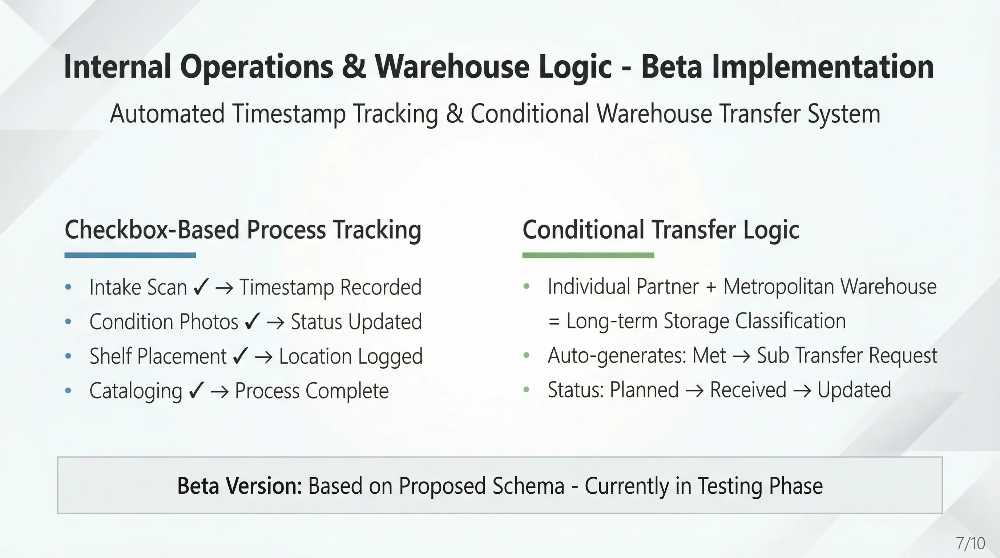
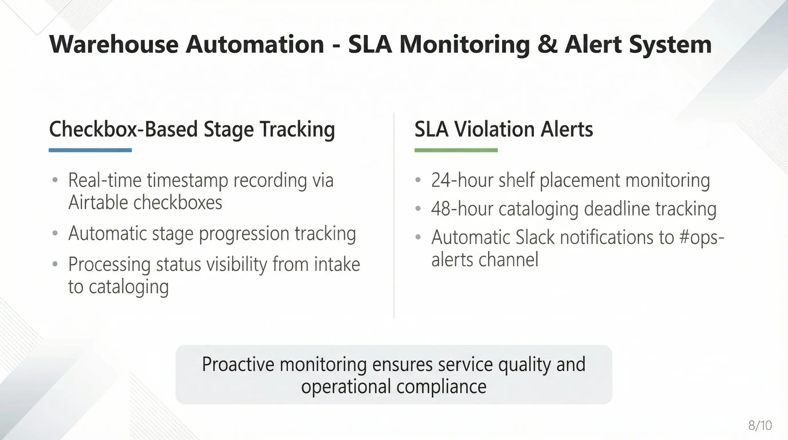

## 3. Internal Parts Operations & Warehouse Logic

This section covers the operational system managing the process from part arrival at the warehouse to **[Intake → Cleaning/Photos → Shelving → Listing]** using Airtable checkboxes and automation logic.

> **⚠️ Disclaimer**
> The automation logic in this section (checkbox-based status tracking, warehouse transfer logic, etc.) is a **Beta version** implemented based on the currently proposed schema.
> As Kickback is currently redesigning the internal operational flow for 'Parts Registration' and 'Intake Processing', **logic modifications and field structure changes may occur** once the process is finalized.

### 1. Implemented Automation Flow
This flow proceeds for parts that have been formally registered in the system following the completion of the 'Individual Parts Agreement' signature in the **[2. Contract Automation]** stage.

The functionality demonstrated in the video covers: **[Step-by-step Timestamp Recording → Auto-Creation of Warehouse Transfers → SLA Violation Detection & Alerting]**.

#### Checkbox-based Timestamping (Step Tracking)
* When an operator clicks the checkbox for each processing step (e.g., `Intake Scan ✔`, `Condition Photos ✔`) in Airtable, the `NOW()` value is immediately recorded in the corresponding timestamp field (`... At`).
* This automatically updates the `Processing Stage`. (e.g., Intake -> Photos -> Temp Shelf).

#### Conditional Routing & Transfer (Conditional Movement Creation)
* **Logic:** If the `Owner Partner Type` is **Individual** and the intake warehouse is **Metropolitan (Met)**, the system identifies it as a 'Long Term' storage item.
* **Automation:** When the `Transfer Needed?` field calculates to `1 (True)`, automation automatically creates a **[Met → Sub]** movement request record in the `Warehouse Transfers` table. (Status: Planned).

#### Transfer Receipt Sync (Completion of Movement)
* When the status of the transfer record is changed to `Received`, the `Current Warehouse` information for the corresponding part is automatically updated to the destination warehouse.

#### SLA Monitoring & Alert (Delay Warnings)
* If major SLA criteria are violated (e.g., shelving within 24h of intake, listing within 48h), a warning message is automatically sent to Slack (`#ops-alerts`).

### 2. Remaining Flow & Future Implementation
The current logic focuses on internal Airtable data processing, and interface integration for actual field operations remains.

#### QR Code Scanner Integration (Field Application)
* Currently, checkboxes are clicked in the Airtable Grid View. In the future, we plan to integrate Webhooks so that scanning a QR code with a mobile scanner app (or handheld terminal) automatically checks `Intake Scan ✔`.

#### Reflection of Kickback's Finalized Process (Modification Planned)
* The schema will be optimized as soon as Kickback's new part registration procedures (timing of photo taking, initial data creation method, etc.) are confirmed.

### 3. Test Methods & Video Analysis

#### 3-1. Test Methods
1.  **Prepare Part:** Locate a test part record generated in the previous contract stage where `Owner Partner Type` is 'Individual'.
2.  **Process Intake:** Set `Current Warehouse` to a 'Met' type warehouse (e.g., MD-PG-Met-02) and click the `Intake Scan ✔` checkbox.
3.  **Verify Transfer Creation:** Check if `Transfer Needed?` is checked and if a new transfer request has appeared in the `Warehouse Transfers` table.
4.  **Verify Timestamps:** Confirm that time fields are populated each time a step checkbox (Photos, Shelving, etc.) is clicked.
5.  **SLA Test:** Forcibly modify the `Received At` time to the past (e.g., 3 days ago) and verify that an SLA Breach notification arrives in Slack.

#### 3-2. Video Walkthrough & Timeline Analysis

**Video (YouTube):**

  <iframe
    width="100%"
    height="405"
    src="https://www.youtube.com/embed/g51QEAlks-c"
    title="Internal Parts Operations & Warehouse Logic - Video Walkthrough"
    frameborder="0"
    allow="accelerometer; autoplay; clipboard-write; encrypted-media; gyroscope; picture-in-picture; web-share"
    allowfullscreen>
  </iframe>

| Timeline | Stage | Detailed Description |
| :--- | :--- | :--- |
| **00:00 ~ 00:13** | **Check Data Structure** | Confirm the basic structure of the `Parts` table (QR Code, Status, etc.) and the auto-linking of `Owner Partner Type`. |
| **00:14 ~ 00:19** | **Timestamp Automation** | **Clicking the `Intake Scan` checkbox** automatically records the current time in the `Intake Scanned At` field on the right. |
| **00:20 ~ 00:26** | **Set Warehouse** | Change the part's `Current Warehouse` from 'VA-FX-Sub-03' (Suburban) to **'MD-PG-Met-02' (Metropolitan)**. |
| **00:27 ~ 00:33** | **Routing Logic Trigger** | Since the Partner Type is **Individual** and the Warehouse is **Met**, the `Transfer Needed?` field automatically calculates to **1 (True)**. |
| **00:34 ~ 00:43** | **Create Transfer Request** | Navigate to the `Warehouse Transfers` tab. Confirm that a **new Transfer record (Status: Planned)** has been created by the triggered logic. |
| **00:50 ~ 00:58** | **Complete Transfer** | Change the status of the created Transfer to **`Received`**. Returning to the Parts tab, confirm that `Current Warehouse` has updated to the destination warehouse. |
| **01:10 ~ 01:17** | **SLA Test** | Simulate a 48-hour exceeded situation (SLA Breach) by forcibly changing the `Received At` date to November 10th (past). |
| **01:18 ~ 01:22** | **Slack Alert** | Switch to the Slack screen. Confirm the arrival of the **"SLA Breach - 48h Receipt->Listing"** warning message. |
