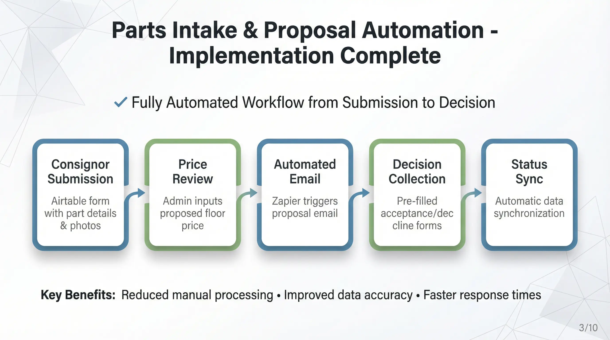

## 1. Parts Intake & Offer Automation

This section covers the automation flow from the Consignor submitting part details, Kickback proposing a price, to the Consignor accepting the offer.

### 1. Implemented Automation Flow
The functionality demonstrated in the current video covers the process: **[Intake Form Submission → Admin Price Setting & Sending Approval → Offer Email Dispatch → Consignor Accept/Decline → Data Synchronization]**.

#### Parts Inquiry Submission
* When a consignor submits part details (including photos) via the Airtable Form, a record is automatically created in the `Parts Inquiries` table.
* **Parts Inquiry Submission Form:** [Open form](https://airtable.com/app40FhuAF7dShHSy/pagkSTLKUgqffRmOE/form)

#### Proposed Floor Price Entry & Sending Approval
* After internal review, an admin enters the amount in the `Proposed Floor Price` field of the corresponding record.
* **[Important]** Automation only begins after the admin clicks the **Email Sending Trigger checkbox** following the price entry. (This is to prevent errors from incorrect inputs).

#### Offer Email Auto-Dispatch (Zapier)
* Once the checkbox is clicked, Zapier is triggered to send an email to the consignor.
* The email includes **unique pre-filled URLs** for accepting ("Proceed") or declining ("Decline") the offer.

#### Consignor Decision (Response Collection)
* When the consignor clicks a link in the email, an Airtable Form opens with the part information and response value (`Accepted`/`Declined`) already pre-filled.
* The consignor can submit their decision by simply clicking the submit button without needing to log in.
* **Parts Response Collection Form:** [Open form](https://airtable.com/app40FhuAF7dShHSy/pagZY9DIx3DSKzx2C/form)

#### Status Synchronization
* Immediately upon form submission, the status value of the original data is automatically updated to `Accepted` or `Declined`.

### 2. Remaining Flow & Future Implementation
The current flow is complete up to the data update upon 'Price Acceptance'. The contract generation part will proceed according to the client's (Kickback) schedule.

#### SignWell Contract Auto-Generation & Dispatch (Pending)
* **Status:** Kickback is currently adjusting its internal contract processes and templates.
* **Plan:** Once internal adjustments are complete and details are provided, follow-up development for SignWell integration and automatic dispatch logic will proceed.

#### 72-Hour Offer Expiration Logic
* Logic will be added to automatically change the status to `Expired` and deactivate the link if there is no response within 72 hours of sending the offer.

### 3. Test Methods & Video Analysis

#### 3-1. Test Methods
1.  **Submit Form:** Access the `Parts Inquiry Submission Form`, enter part details and contact information, and submit.
2.  **Verify Data:** Check if a new record has been created in the Airtable `Parts Inquiries` table.
3.  **Enter Price:** Enter a test amount (e.g., $7,777) in the `Proposed Floor Price` field of that record.
4.  **Execute Sending Trigger:** Click the `Email sending time` (or designated sending confirmation) checkbox.
5.  **Receive Email:** Check if a "Kickback Review" email has arrived at the entered email address.
6.  **Verify Link Action:** Click the "Proceed with agreement" button in the email body. Verify that the opening form has information correctly pre-filled, then submit.
7.  **Verify Final Update:** Return to Airtable and confirm that the `Response` field has changed to `Accepted`.

#### 3-2. Video Walkthrough & Timeline Analysis

**Video (YouTube):**

  <iframe
    width="100%"
    height="405"
    src="https://www.youtube.com/embed/yARr8zCvb4w"
    title="Parts Intake & Offer Automation - Video Walkthrough"
    frameborder="0"
    allow="accelerometer; autoplay; clipboard-write; encrypted-media; gyroscope; picture-in-picture; web-share"
    allowfullscreen>
  </iframe>

| Timeline | Stage | Detailed Description |
| :--- | :--- | :--- |
| **00:00 ~ 01:03** | **Intake Submission** | Consignor accesses the Airtable Form, uploads vehicle info (v6 engine, etc.) and photos, and submits. |
| **01:04 ~ 01:21** | **Data Registration Check** | Verify that the submitted record is created in the `Parts Inquiries` table on the Admin screen (Airtable). |
| **01:22 ~ 01:25** | **Price Proposal & Send** | Admin enters **$7,777.00** in `Proposed Floor Price` and approves sending by **clicking the checkbox** on the right. |
| **01:26 ~ 01:31** | **System Processing** | Zapier runs in the background, transitioning to email sent status (screen transition). |
| **01:32 ~ 01:39** | **Email Receipt Check** | Consignor (Gmail) screen. Receives the offer email containing the proposed price ($7,777) and checks the content. |
| **01:40 ~ 01:46** | **Execute Acceptance** | Click **"Proceed with agreement"** link in the email. A pre-filled form opens, and the user submits immediately. |
| **01:47 ~ 01:52** | **Final Status Update** | Verify on the Admin screen (Airtable) that the `Response` field of the record automatically updates to **"Accepted"**. |
