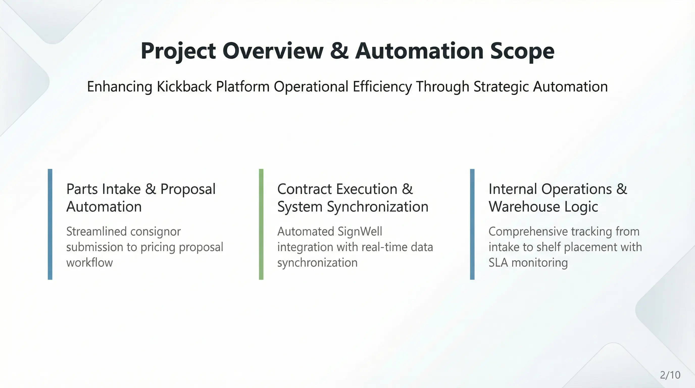

# Kickback Dev Docs

Central documentation hub for Kickback operations.  
This index is the top level for multiple processes (e.g., Contract Automation, Settlement) and points to the detailed docs inside each process.

---

## Kickback Platform Automation Operations Manual

This manual is the umbrella guide for each automation stream, organized by the operational lifecycle.

### Ops Links
* **<a href="https://airtable.com/app40FhuAF7dShHSy?" target="_blank" rel="noopener noreferrer">Ops Airtable Base</a>**
* **<a href="https://zapier.com/editor/330003026/published" target="_blank" rel="noopener noreferrer">SignWell → Airtable Automation (Zapier)</a>**
* **<a href="https://zapier.com/editor/339379457/published" target="_blank" rel="noopener noreferrer">Settlement Automation (Zapier)</a>**

### 1. Intake & Offer
* **[Parts Intake & Offer Automation](7.automation/parts-intake.md)** *Covers the flow from Consignor submission, Price proposal, to Offer acceptance.*

### 2. Contract Execution
* **[SignWell Contract Execution & System Sync](7.automation/signwell-contract-execution.md)** *Covers the flow of signing agreements, archiving PDFs, and syncing partner data.*

### 3. Internal Operations
* **[Internal Parts Operations & Warehouse Logic](7.automation/internal-parts-operations-warehouse-logic.md)** *Covers warehouse intake, timestamps, transfers, and SLA monitoring.*

### 4. Settlement Operations
* **[Airtable Payout Processing – Complete Operations Manual](7.automation/airtable_payout_processing.md)** *Covers payout calculations, Stripe transfers, and settlement batch tracking.*
